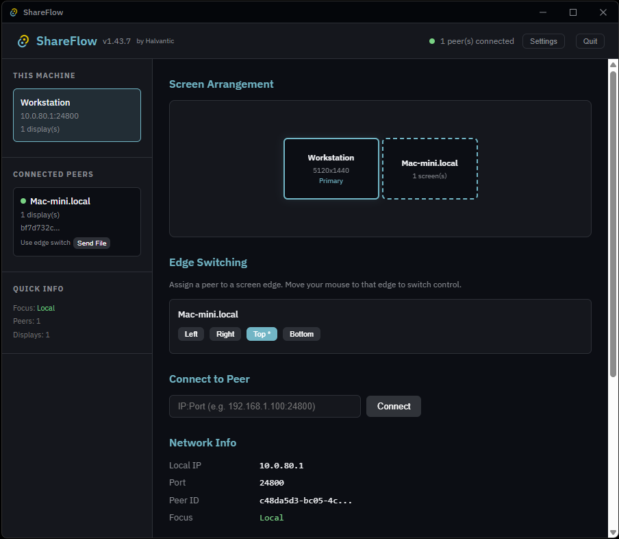

<div align="center">

# ShareFlow 🖱️⌨️

### Seamless software KVM to share one keyboard and mouse across multiple PCs.

[](https://www.rust-lang.org/)
[](https://tauri.app/)
[](https://react.dev/)
[](https://github.com/halvantic/shareflow)

<p align="center">
  <a href="#-overview">Overview</a> •
  <a href="#-key-features">Key Features</a> •
  <a href="#-how-it-works">How It Works</a> •
  <a href="#-protocol">Protocol</a> •
  <a href="#-installation--building">Installation</a> •
  <a href="#-security--networking">Security</a> •
  <a href="#-project-structure">Project Structure</a> •
  <a href="#-contributing">Contributing</a>
</p>



</div>

---

## ⚡ Overview

**ShareFlow** is a lightweight, high-performance software KVM switch built with **Rust** and **Tauri**. It lets you control multiple Windows and macOS computers using a single keyboard and mouse over your local network.

Move your cursor to the edge of your screen, and it seamlessly transitions to the neighboring machine—no hardware switch, no extra dongles, and no manual IP configuration required.

---

## ✨ Key Features

- **🎯 Directional Edge Switching:** Push the cursor to any screen edge to transfer focus to the next machine. Includes a 45° directional gate to prevent accidental triggers during horizontal dragging.
- **📋 Automatic Clipboard Sync:** Text and image clipboard content transfers automatically when focus switches.
- **📁 File Transfer:** Pick a file to send to a discovered peer; it streams directly across machines with chunked network transfers.
- **🔍 Zero-Config LAN Discovery:** Peers appear automatically on your subnet using local UDP discovery.
- **🔒 Encrypted Traffic:** All TCP communication is encrypted using TLS with Trust-On-First-Use (TOFU) certificate pinning, plus optional HMAC-based pairing-code authentication for the connection handshake.
- **📐 Multi-Monitor Proportional Mapping:** Accurately maps cursor position across displays of different sizes and resolutions.
- **⌨️ Configurable Hotkey Return:** Press a hotkey combo (`Scroll Lock` by default) at any time to snap control back to the local host.
- **⚡ Remote Power-On:** Wake a configured peer over the network via Intel AMT (WS-Management/Digest Auth), directly from the tray menu or UI.
- **🖥️ Cross-Platform Support:** Primary controller on Windows, peer support on macOS. Linux input capture/injection is currently a stub and not yet functional.

---

## 🛠️ How It Works

### Discovery

On launch, each machine broadcasts a UDP announcement on port `24801` with a magic header (`SFLO`). Other machines on the same subnet listen for these broadcasts and surface discovered peers in the UI. Announcements are timestamped to prevent replay attacks and expire after 30 seconds.

### Connection

Once a peer is accepted, a TLS TCP connection is established on port `24800`. On first connect, the certificate fingerprint is stored with Trust-On-First-Use (TOFU). Subsequent connections verify against the stored fingerprint. All protocol messages are encoded as length-prefixed `bincode` frames.

### Focus & Edge Switching

Each machine tracks which machine currently has focus, meaning the machine receiving physical input.

1. When the cursor reaches the desktop boundary, edge detection fires if movement is predominantly toward the edge (45° angle check).
2. A `SwitchFocus` message is sent to the target peer with entry coordinates.
3. The sending machine suppresses local input (cursor hidden, events blocked).
4. The receiving machine injects the cursor at the mapped entry point and begins processing forwarded events.
5. A 300ms cooldown prevents oscillation after any switch.

### Input Capture & Injection

- **Windows (Sender/Primary):** Low-level `WH_MOUSE_LL` and `WH_KEYBOARD_LL` hooks capture input before it reaches applications. A warp-to-center technique keeps the physical cursor stationary while computing virtual deltas. The cursor is hidden using `ShowCursor`.
- **macOS (Peer/Receiver):** `CGEventTap` at `kCGHIDEventTap` captures input with full suppression capabilities. Injection uses `CGWarpMouseCursorPosition` and `CGEventCreateMouseEvent` with absolute and relative delta fields set, which is required for 3D viewports and dragging. Modifier key states are tracked independently to prevent stuck modifiers.

### Clipboard Sync

When focus switches to a remote machine, the local clipboard is pushed immediately so `Ctrl+V` works on the remote machine right away. Both text and image clipboard content are supported.

---

## 📡 Protocol

All messages are serialized with `bincode` and framed with a 4-byte big-endian length prefix. Key message types include:

| Message | Description |
| :--- | :--- |
| `Hello` / `HelloAck` | Handshake; exchanges peer ID, name, and screen layout |
| `MouseMove` | Absolute cursor position |
| `MouseButton` | Button press/release |
| `MouseScroll` | Scroll delta |
| `Key` | Hardware scancode press/release |
| `SwitchFocus` | Trigger focus transition with entry coordinates |
| `ClipboardUpdate` | Clipboard content push |
| `FileStart` / `Chunk` / `Done` | Chunked file transfer |
| `Ping` / `Pong` | Keepalive; 3 missed pongs closes the connection |

---

## 🚀 Installation & Building

### Prerequisites

| Platform | Requirements |
| :--- | :--- |
| **All Platforms** | Rust (stable 1.77+), Node.js (18+) |
| **Windows** | Visual C++ Build Tools (Desktop development with C++), WebView2, WiX Toolset v3 *(for `.msi` builds only)* |
| **macOS** | Xcode Command Line Tools (`xcode-select --install`) |

### Development Setup

```bash
# Clone the repository
git clone https://github.com/halvantic/shareflow.git
cd shareflow

# Install frontend dependencies
npm install

# Run in development mode
npm run tauri dev
```

### macOS Accessibility Permission

On macOS, ShareFlow requires Accessibility permission to capture and inject HID input events.

1. Open System Settings > Privacy & Security > Accessibility.
2. Add ShareFlow to the allowed list.
3. Restart ShareFlow.

Without this permission, the event tap fails silently and input will not be captured or injected.

---

## 🔒 Security & Networking

ShareFlow is designed for private local networks.

| Port | Protocol | Purpose |
| :--- | :--- | :--- |
| `24801` | UDP | LAN peer broadcast & discovery (magic header `SFLO`) |
| `24800` | TCP (TLS) | Encrypted peer input, clipboard, and file streaming |

- **Replay Protection:** Discovery broadcasts are timestamped and expire after 30 seconds.
- **TOFU Pinning:** Peer certificates are stored on first connection and verified continuously.
- **Optional Pairing Code:** If a pairing code is configured, new connections must complete an HMAC-SHA256 challenge/response before the session is accepted.
- **Rate Limiting:** Incoming input events are token-bucket limited (200/sec sustained, burst 50) to bound abuse from a misbehaving or malicious peer.

---

## 📁 Project Structure

```text
shareflow/
├── src/                        # React/TypeScript frontend (Tauri UI)
├── public/                     # Static frontend assets
├── docs/                       # Project documentation
├── kext/                       # macOS kernel extension assets
├── index.html                  # Vite entry point
├── package.json                # Frontend dependencies and scripts
├── tsconfig.json               # TypeScript config
├── vite.config.ts              # Vite configuration
└── src-tauri/
    ├── Cargo.toml              # Tauri/Rust backend manifest
    ├── tauri.conf.json         # Tauri app configuration
    └── src/
        ├── core/
        │   ├── engine.rs       # Focus state machine, edge switching logic
        │   ├── runtime.rs      # Event loop wiring engine, input, and clipboard together
        │   ├── screen.rs       # Edge detection, boundary validation
        │   ├── protocol.rs     # Message types, encode/decode
        │   ├── config.rs       # App configuration, neighbor layout
        │   └── hotkey.rs       # Configurable hotkey detection (default: Scroll Lock)
        ├── input/
        │   ├── windows.rs      # Windows low-level hooks (capture + injection)
        │   ├── macos.rs        # macOS CGEventTap (capture + injection)
        │   └── linux.rs        # Linux (stub, not yet functional)
        ├── network/
        │   ├── discovery.rs    # UDP LAN broadcast discovery
        │   ├── server.rs       # TLS TCP server, message routing
        │   ├── session.rs      # Per-connection session loop, input rate limiting
        │   ├── connection.rs   # Framed message reader/writer
        │   ├── auth.rs         # HMAC pairing-code challenge/response
        │   └── tls.rs          # Certificate generation and pinning
        ├── clipboard/
        │   └── sync.rs         # Clipboard monitoring and sync
        ├── file_transfer/
        │   ├── sender.rs       # Chunked streaming file sender
        │   └── receiver.rs     # File receiver with bounds checking
        ├── amt/
        │   └── ipmi.rs         # Intel AMT remote power-on (WS-Management/Digest Auth)
        ├── credentials.rs      # Stored identity and trust state
        ├── lib.rs              # Library exports, Tauri commands
        └── main.rs             # Tauri app entrypoint
```

---

## 🤝 Contributing

Contributions are welcome. Please feel free to open an issue or submit a pull request.

### Contribution Workflow

1. Fork the project.
2. Create your feature branch:
   ```bash
   git checkout -b feature/AmazingFeature
   ```
3. Commit your changes:
   ```bash
   git commit -m "Add some AmazingFeature"
   ```
4. Push to the branch:
   ```bash
   git push origin feature/AmazingFeature
   ```
5. Open a pull request.

---

Enjoying ShareFlow? Give it a ⭐ on GitHub to support development.
